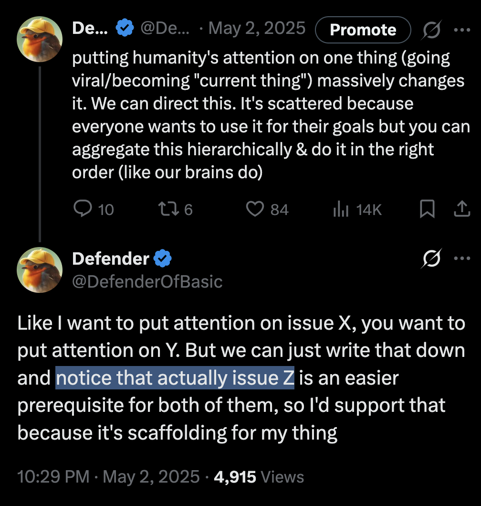
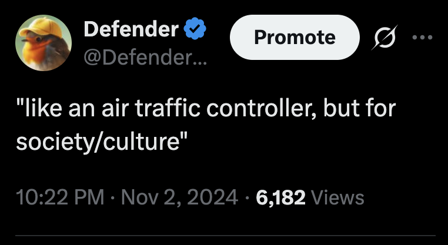

I am hosting a research retreat in Ithaca NY. Jan 13th through Feb 4th. The goal is to put together a pitch deck.

After that we'll spend a few days in NYC (Feb 5th through Feb 9). 

### What's the goal?

We're trying to fund at least one more year of the "universal alignment" work I've been doing, and have some formal structure around it so I can do this with a team, at a bigger scale, and in a way where the successes from the work can feed back into the process and continue to fuel it.

### What is "universal alignment" ?

It's the generalized version of [AI alignment](https://en.wikipedia.org/wiki/AI_alignment). Instead of asking _"how do we make AI do the right thing"_, we ask _"how do we make an `agent` do the right thing"_, where an `agent` could be an individual human, a company, a community, or an economy.

Another way to think of it is that it's asking the following pair of questions:

1. What's the best possible state that satisfies the desires of all the agents in the system?
1. What's the bottleneck to that?

This requires simultaneously looking in "two directions" - towards the future, at potential, and at what currently is. 

<!-- 

- Community Archive case study
- Defender history

> "we want to figure out how to go there, from here" - which means figuring out (1) where there is and (2) where here is 

> TODO: X / Y / Z 

"moving laterally through academia"

 -->